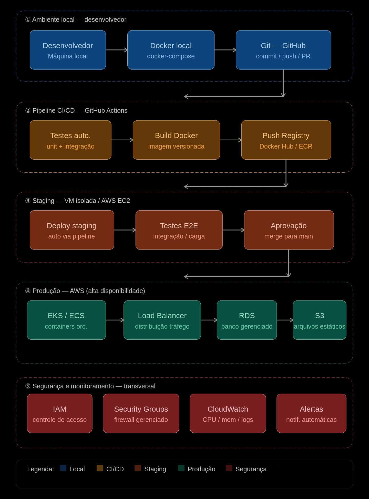

# Estudo de Caso I — DevStore: Sistemas Operacionais
**Faculdade de Tecnologia — FATEC**
Prof. Me. Deivison S. Takatu

---

## 1. Contexto do Problema

A **DevStore** é uma startup de desenvolvimento web que enfrenta três problemas centrais em sua infraestrutura de TI:

1. **Infraestrutura desorganizada** — servidores locais sem padronização, dificultando gerenciamento e crescimento sustentável.
2. **Pipeline de desenvolvimento frágil** — código desenvolvido diretamente na máquina do desenvolvedor, sem testes automatizados nem versionamento.
3. **Ausência de escalabilidade e segurança** — sem isolamento de ambientes, controle de acesso estruturado ou monitoramento contínuo.

---

## 2. Solução Proposta — Visão Geral

### 2.1 Padronização do Ambiente de Desenvolvimento (Local)

Cada desenvolvedor passa a trabalhar com **Docker** localmente. Em vez de instalar dependências diretamente na máquina, o projeto sobe via `docker-compose`, garantindo que todos rodem o mesmo ambiente de forma padronizada. Isso elimina problemas de incompatibilidade entre máquinas ("funciona na minha máquina").

### 2.2 Versionamento e Pipeline CI/CD

Adoção do **Git** (GitHub ou GitLab) com branches organizadas, por exemplo: `dev`, `staging` e `main`. A cada push, um pipeline automatizado (**GitHub Actions** ou **GitLab CI**) executa testes, build e deploy — eliminando intervenção manual e garantindo rastreabilidade completa das mudanças.

### 2.3 Ambientes Isolados com Virtualização

Para testes mais pesados ou simulações próximas do ambiente de produção, uso de **VMs** (via VirtualBox ou AWS EC2) com recursos controlados (CPU e RAM limitados por configuração). Isso garante separação total entre o ambiente de testes e o de produção, evitando contaminação de ambientes.

### 2.4 Containerização da Aplicação (Docker + Orquestração)

A aplicação é empacotada em **containers Docker** com imagens versionadas. Em produção, utiliza-se **Docker Swarm** ou **Kubernetes (EKS na AWS)** para orquestração, permitindo escalar horizontalmente conforme a demanda cresce, sem necessidade de provisionar novos servidores físicos manualmente.

### 2.5 Infraestrutura em Nuvem (AWS)

A produção migra para a **AWS**, utilizando serviços como EC2, RDS, S3 e Load Balancer. Isso garante alta disponibilidade, backups automáticos e escalabilidade sob demanda, eliminando a dependência de hardware físico local.

### 2.6 Segurança e Monitoramento

Implementação de **IAM** (controle de acesso por função/perfil), **Security Groups** (firewall gerenciado), e ferramentas de monitoramento como **CloudWatch** ou **Grafana + Prometheus** para acompanhar CPU, memória, logs e disparar alertas em caso de falhas.

---

## 3. Arquitetura Proposta — Diagrama

O diagrama abaixo apresenta a arquitetura completa da solução, organizada em cinco camadas sequenciais: do ambiente local do desenvolvedor até a produção em nuvem, com a camada de segurança e monitoramento atuando de forma transversal em todos os estágios.



> **Legenda de cores:** 🔵 Azul = Ambiente Local · 🟡 Amarelo/Marrom = CI/CD · 🟠 Laranja = Staging · 🟢 Verde = Produção AWS · 🔴 Vermelho = Segurança e Monitoramento

---

### 3.1 Ambiente Local — Desenvolvedor

O fluxo começa na máquina do desenvolvedor, que trabalha com **Docker local via `docker-compose`**, garantindo padronização do ambiente. Após o desenvolvimento, o código é versionado e enviado ao repositório remoto via **Git/GitHub** (commit / push / PR).

```
Desenvolvedor → Docker local (docker-compose) → Git — GitHub (commit / push / PR)
```

---

### 3.2 Pipeline CI/CD — GitHub Actions

A cada Pull Request ou push para branches protegidas, o **GitHub Actions** dispara automaticamente o pipeline, que executa:

1. **Testes automatizados** (unit + integração)
2. **Build da imagem Docker** (versionada)
3. **Push para o Registry** (Docker Hub ou ECR da AWS)

```
PR → Testes auto. (unit + integração) → Build Docker (imagem versionada) → Push Registry (Docker Hub / ECR)
```

---

### 3.3 Staging — VM Isolada / AWS EC2

Após o build, o pipeline realiza o deploy automático no ambiente de **staging**, onde são executados testes E2E e de carga. Somente após aprovação o código avança para produção via merge na branch `main`.

```
Deploy staging (auto via pipeline) → Testes E2E (integração / carga) → Aprovação (merge para main)
```

---

### 3.4 Produção — AWS (Alta Disponibilidade)

A produção roda na **AWS**, com a seguinte stack:

| Componente | Função |
|---|---|
| **EKS / ECS** | Orquestração de containers |
| **Load Balancer** | Distribuição de tráfego entre instâncias |
| **RDS** | Banco de dados gerenciado |
| **S3** | Armazenamento de arquivos estáticos |

```
EKS/ECS → Load Balancer → RDS (banco gerenciado) → S3 (arquivos estáticos)
```

---

### 3.5 Segurança e Monitoramento — Camada Transversal

A segurança e o monitoramento atuam em **todos os ambientes simultaneamente**:

| Componente | Função |
|---|---|
| **IAM** | Controle de acesso por perfil/função |
| **Security Groups** | Firewall gerenciado na AWS |
| **CloudWatch** | Monitoramento de CPU, memória e logs |
| **Alertas** | Notificações automáticas em caso de falhas |

---

## 4. Decisões Técnicas Justificadas

| Decisão | Tecnologia Escolhida | Justificativa |
|---|---|---|
| Containerização | Docker | Leveza, portabilidade e padronização de ambientes |
| Orquestração | Kubernetes / EKS | Escalabilidade horizontal e alta disponibilidade |
| Nuvem | AWS | Maturidade, variedade de serviços gerenciados e escalabilidade sob demanda |
| CI/CD | GitHub Actions | Integração nativa com Git, fácil configuração e gratuito para repositórios públicos |
| Monitoramento | CloudWatch / Grafana | Visibilidade de métricas, logs e alertas em tempo real |
| Segurança | IAM + Security Groups | Controle granular de acesso e firewall gerenciado sem custo adicional |
| Versionamento | Git (GitHub/GitLab) | Padrão de mercado, rastreabilidade e suporte a fluxos colaborativos |

---

## 5. Estratégias de Implantação, Manutenção e Expansão

**Implantação:** Realizar a migração de forma incremental — primeiro containerizar as aplicações localmente, depois configurar o pipeline CI/CD, e por último migrar a produção para a nuvem. Isso reduz riscos e permite reversão em caso de problemas.

**Manutenção:** Utilizar tags de versionamento nas imagens Docker, manter o pipeline com testes automatizados em cada merge, e revisar as permissões de IAM periodicamente para garantir o princípio do menor privilégio.

**Expansão:** A adoção de Kubernetes (EKS) na AWS permite adicionar novos serviços ou aumentar a capacidade de processamento sem mudanças estruturais na arquitetura. Novos ambientes (ex: ambiente de homologação para clientes) podem ser criados como novos namespaces no cluster, com custo e esforço mínimos.

---

## 6. Referências

- TANENBAUM, Andrew S.; BOS, Herbert. *Sistemas Operacionais Modernos*. 4. ed. São Paulo: Pearson, 2016.
- SILBERSCHATZ, Abraham; GALVIN, Peter B.; GAGNE, Greg. *Fundamentos de Sistemas Operacionais*. 9. ed. Rio de Janeiro: LTC, 2015.
- DOCKER INC. *Docker Documentation*. Disponível em: https://docs.docker.com
- AMAZON WEB SERVICES. *AWS Documentation*. Disponível em: https://docs.aws.amazon.com
- GitHub Actions Documentation. Disponível em: https://docs.github.com/actions
